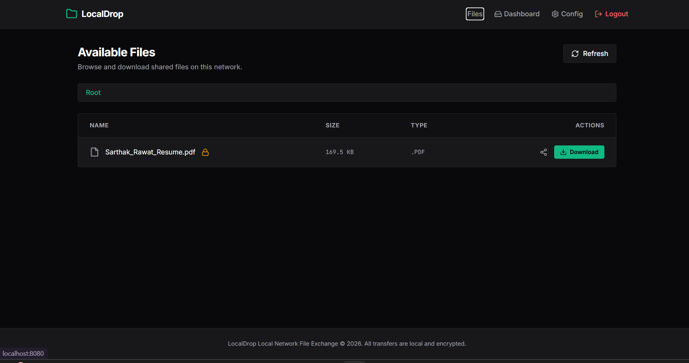
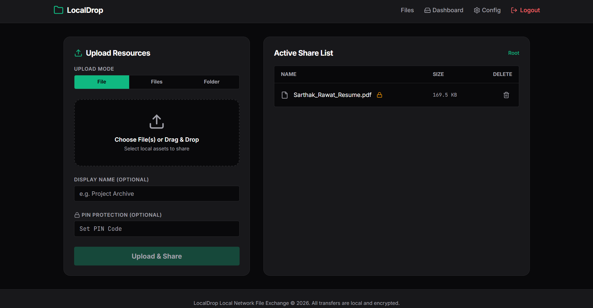
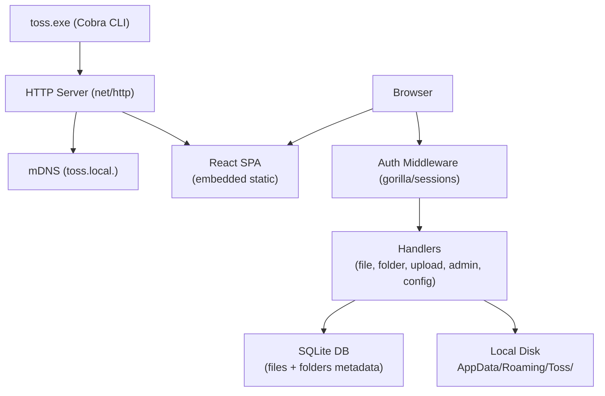

# Toss

Fast local network file sharing. No internet, no cloud, no setup beyond running one binary.




[](https://youtu.be/PLACEHOLDER)

## How it works

Run `toss.exe start` on one machine. Every other device on the same Wi-Fi opens the IP in a browser and can download files immediately. Admins can upload, delete, and configure from the dashboard.

## Architecture



## Getting started

### Prerequisites

- Go 1.22+
- Node.js 18+ (only needed if rebuilding the frontend)

### Clone and run

```bash
git clone https://github.com/SarthakRawat-1/Toss.git
cd Toss
go build -o toss.exe .
.\toss.exe start
```

Open `http://localhost:8080` in your browser.

Other devices on the same network open `http://<your-ip>:8080`.

### Build the frontend (optional)

Only needed if you modify UI code.

```bash
cd ui
npm install
npm run build
```

Then rebuild the Go binary so the new static assets get embedded.

## CLI reference

```
.\toss.exe start                 Start the server in background
.\toss.exe start --auth=false   Start without requiring admin login
.\toss.exe stop                  Stop the server
.\toss.exe addadmin              Create an admin account (interactive)
.\toss.exe adminlist             List all admin accounts
.\toss.exe init                  Initialize storage directories
.\toss.exe version               Print version
```

## Admin accounts

Admin accounts are stored in the local SQLite database with bcrypt hashing. Create one before enabling auth:

```bash
.\toss.exe addadmin
```

Then restart with auth enabled (or toggle it from the Config page).

## Configuration

Config is stored at `%AppData%\Roaming\Toss\internal\storage\config.yaml` and can be edited from the Config page in the UI. Changes take effect after restarting the server.

| Setting | Default | Description |
|---|---|---|
| Port | 8080 | HTTP server port |
| Base directory | AppData/Roaming/Toss/.../files/ | Where uploaded files are stored |
| Max file size | 100 MB | Upload size limit |
| Authentication | false | Require admin login to upload/delete |
| Logging | true | Write logs to disk |

## Data locations

```
%AppData%\Roaming\Toss\internal\storage\files\      uploaded files
%AppData%\Roaming\Toss\internal\storage\toss.db     SQLite database
%AppData%\Roaming\Toss\internal\storage\config.yaml server config
%AppData%\Roaming\Toss\toss.pid                     running process ID
```

## Tech stack

| Layer | Technology |
|---|---|
| Backend | Go, net/http (stdlib routing) |
| Database | SQLite (modernc.org/sqlite) |
| Sessions | gorilla/sessions |
| Discovery | mDNS (hashicorp/mdns) |
| Frontend | React, TypeScript, Vite, TailwindCSS |
| CLI | Cobra |

## License

MIT